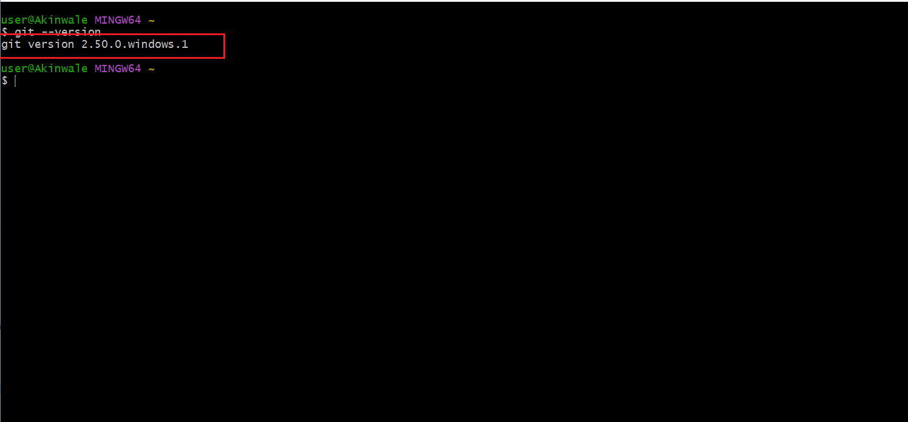

## My Tech Environment Setup

Below is the virtual representation in setting up my tech environment starting my career with darey.io, below is the screenshot of each application readiness. 

1.  I download and setup my vs-code on my PC as shown below:
   
   

2. I download and install Git on my PC as shown below:

    

3. I download and install Virtual Box on my PC as shown below:

    

4. I download and install Ubuntu Desktop on my virtual box as shown below:
   
     

5. I setup my GitHub account as shown below:

     

6. I setup my AWS account as required:

      

Above is the complete setup on my tech environment to kick start my DevOps learning with Darey.io. 