# SHELL SCRIPTING

With the thousands of commands available to the command line user, how can we remember them all? The answer is, we don't. The real power of the computer is its ability to do the work for us. To get it to do that, we use the power of the shell to automate things. We write shell scripts.

## What is Shell Scripting

Imagine we are tasked with setting up new workstations and user accounts regularly at our job. Instead of manually creating each folder and user account, a simple shell script serves as our efficient digital helper. By automating the creation of multiple directories and user accounts with just a few lines of code, it saves us considerable time and effort, allowing us to concentrate on more critical aspects of our work.

Shell scripting is the process of writing and executing a series of instructions in a shell to automate tasks. A shell script is essentially a script or program written in a shell language, such as `Bash, sh, zsh, or PowerShell`?

A basic shell script that will create multiple folders and create multiple linux users at once would look like this.

`#!/bin/bash`

### Create directories
mkdir Folder1
mkdir Folder2
mkdir Folder3

### Create users
sudo useradd user1
sudo useradd user2
sudo useradd user3

### Task:

- Create a folder on an ubuntu server and name it shell-scripting

 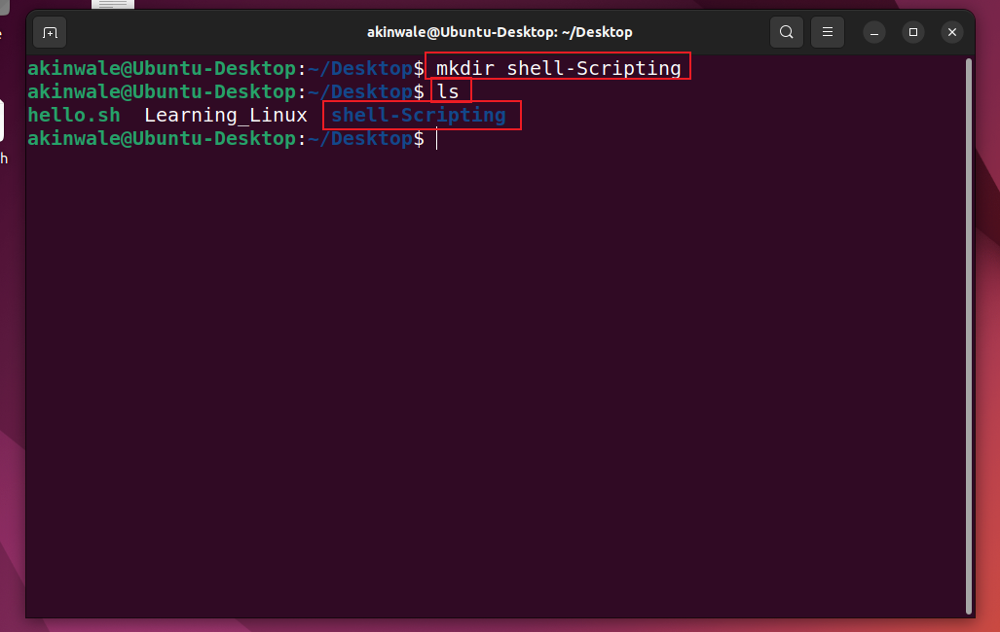

- Using the vim editor, create a file called my_first_shell_script.sh

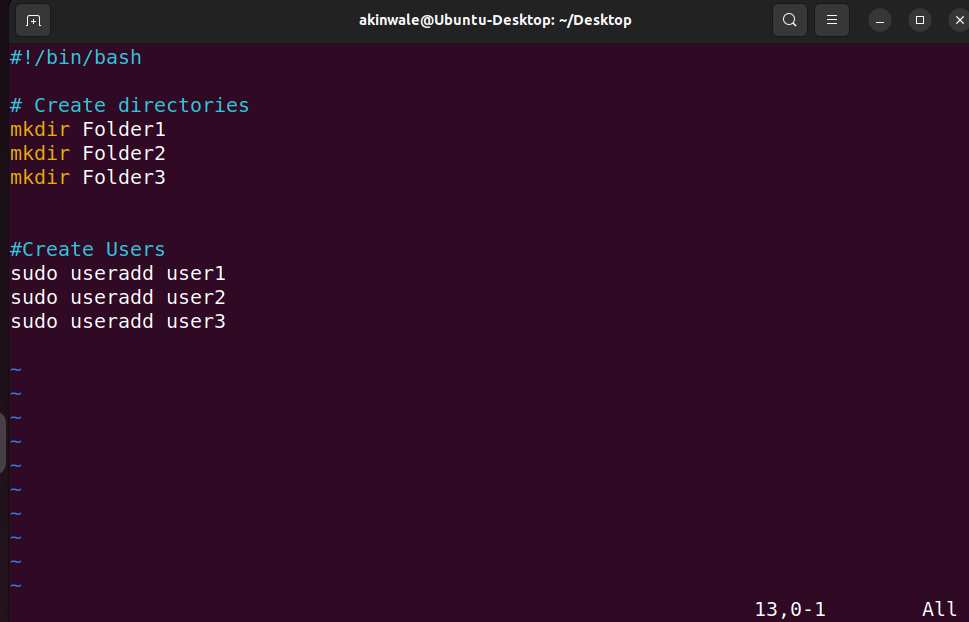

- Put the shell script code above into the new file

- Save the file

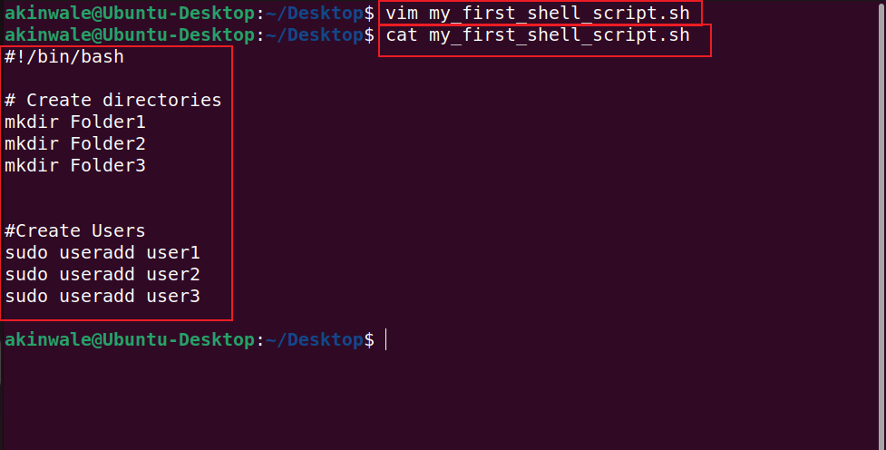

- use cd command to change into the shell-scripting directory

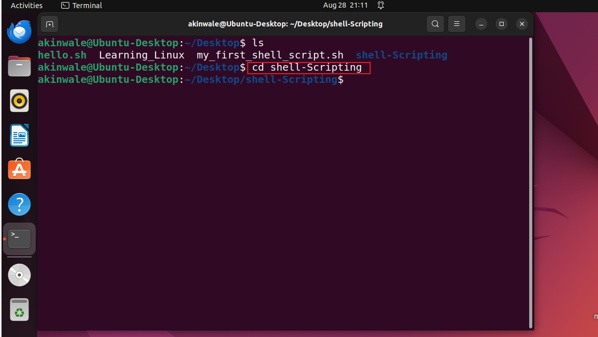

- Use `ls -latr` command to confirm that the file is indeed created.

Something we notice about the permissions of the newly created file is this `-rw-r--r--` which means;

- The owner of the file has `read (r)` and `write (w)` permissions.
- Members of the file's group have `read (r)` permission.
- Others also have `read (r)` permission.
  
However, no one has the `execute (x)` permission, hence the script cannot be executed.

To execute the script, we would typically do something like this.

`./my_first_shell_script.sh`

- `./` This prefix to the file indicates that the command should look for the file in the current directory.
  
- The `dot (.)` represents the current directory, and the slash `(/)` is a directory separator
when we hit enter, we should get a response like

`bash: ./my_first_shell_script.sh: Permission denied`

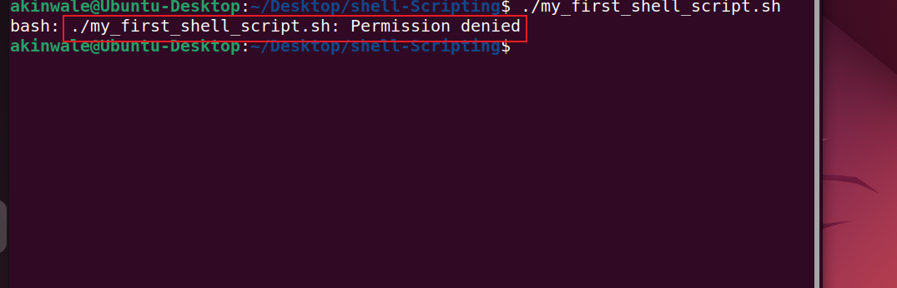

We notice that we now have a Permission denied error which can easily be resolved by giving the file the necessary permission it requires.

But, we also notice the mention of `"bash"` at the beginning of the error message? It indicates that the error message is coming from the Bash shell itself. Bash is the command interpreter or shell that we're using in the terminal to execute commands.

#### Task:

- Add the execute permission for the owner to be able to execute the shell script

    - I will bw using chmod command for this operation 
       `chmod u+x my_first_shell_script.sh`
    
    - 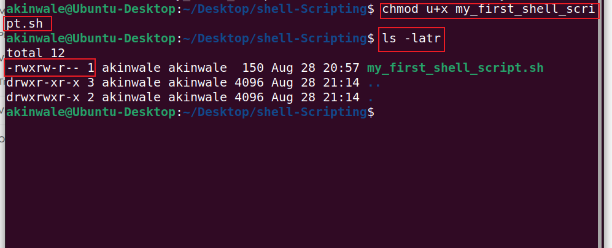  

- Run the shell script.

   - 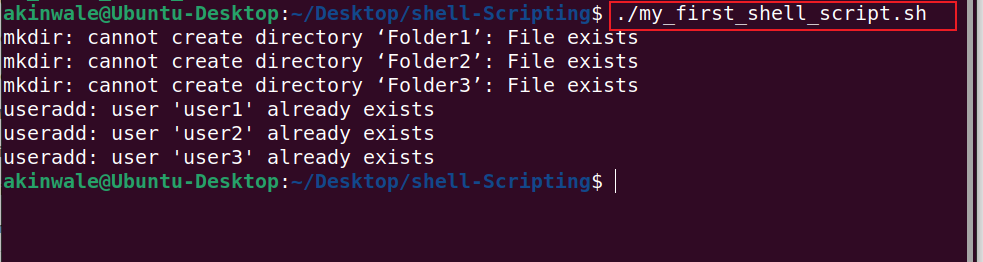

- Evaluate and ensure that 3 folders are created

   - 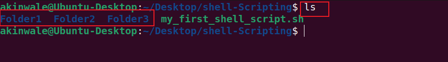

- Evaluate and ensure that 3 users are created on the linux server.

   - 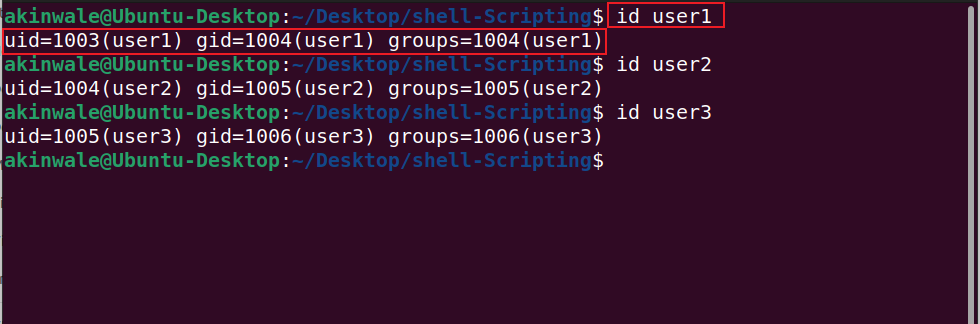

### What Is a Shebang (#!/bin/bash) ?

Notice that, at the beginning of the shell script, we have #!/bin/bash written there. This is what is called a shebang. It is a special notation used in Unix-like operating systems like Linux, to specify the interpreter that should be used to execute the script. In this case, #!/bin/bash specifically indicates that the Bash shell should be used to interpret and execute the script.

We can also explore the `/bin` folder and see the different programs in there. bash is one of them which is used as the interpreter in that script. If we wanted to use another shell like sh, the shebang would be updated to `#!/bin/sh`

`/bin/bash:` This is the absolute path to the Bash shell executable. It tells the system to use the Bash interpreter located at /bin/bash to run the script.

Without a shebang line, the system may not know how to interpret and execute the script, and we may need to explicitly specify the interpreter when running the script

### Variable Declaration and Initialization
   
In programming generally, not just shell scripting, variables are essential for creating dynamic and flexible programs.

Variables can store data of various types such as `numbers`, `strings`, and `arrays`. You can assign values to variables using the `=` `operator`, and access their values using the variable name preceded by a `$` sign.

#### Lets explore a few examples

Example: Assining value to a variable

`name=Akinwale`

From the example above, "Akinwale" was asigned to the variable "name".

Now that the variable is assigned, we may ask, how then can i use it?

### Retrieving value from a variable

After assigning a value to a variable, as shown in the previous example where we assigned "Akinwale" to the variable name, we can utilize this variable in various ways in our script or program. One of the most straightforward methods to use or retrieve the value stored in a variable is by echoing it back to the console. This is done using the `echo` command in shell scripting.

`echo $name`

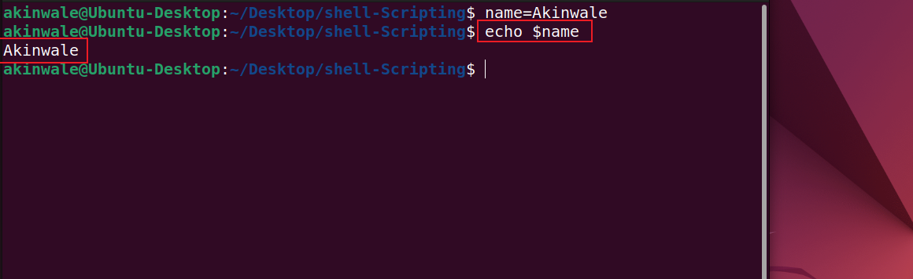

This command instructs the shell to print the value of name to our screen, which, in our case, would output Akinwale.

`echo` is a command used to print a text, variables or values. In this example, echo is used to print a variable which stores a value.

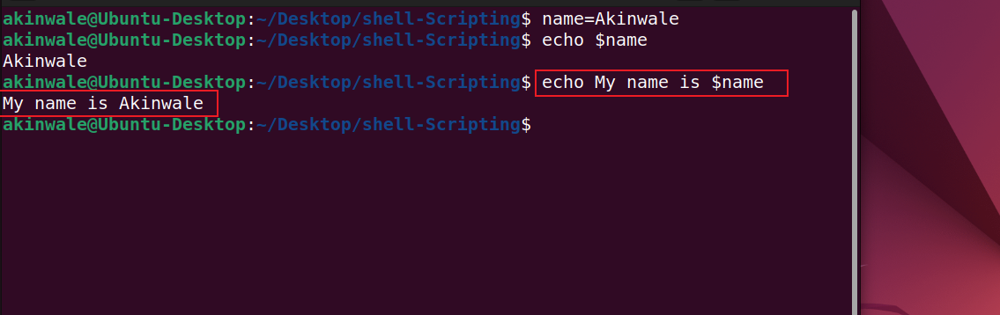

End.

