# Bash Script For Generating a Multiplication Table

**Objective**: To Create a Bash script that generates a multiplication table for a number entered by the user. This project will help to practice using loops, handling user input, and applying conditional logic in Bash scripting.

#### Project Description

Our script should prompt the user to enter a number and then ask if they prefer to see a full multiplication table from 1 to 10 or a partial table within a specified range. Based on the user's choice, the script will display the corresponding multiplication table.

#### Project Requirements

**User Input for Number**: The script must first ask the user to input a number for which the multiplication table will be generated.

**Choice of Table Range**: Next, ask the user if they want a full multiplication table (1 to 10) or a partial table. If they choose partial, prompt them for the start and end of the range.

**Use of Loops**: Implement the logic to generate the multiplication table using loops. You may use either the list form or C-style for loop based on what's appropriate.

**Conditional Logic**: Use if-else statements to handle the logic based on the user's choices (full vs. partial table and valid range input).

**Input Validation**: Ensure that the user enters valid numbers for the multiplication table and the specified range. Provide feedback for invalid inputs and default to a full table if the range is incorrect.

**Readable Output**: Display the multiplication table in a clear and readable format, adhering to the user's choice of range.

**Comments and Code Quality**: Our script should be well-commented, explaining the purpose of different sections and any important variables or logic used. Ensure the code is neatly formatted for easy readability.

### Example Script Flow:

1. Prompt the user to enter a number for the multiplication table.
2. Ask if they want a full table or a partial table.
    - If partial, prompt for the start and end numbers of the range.
3. Validate the range inputs and handle invalid or out-of-bound entries.
4. Generate and display the multiplication table according to the specified range.
5. Provide clear output formatting for ease of reading. Bonus
6. Enhanced User Interaction: Incorporate additional checks or features, like repeating the program for another number without restarting the script.
7. Creative Display Options: Offer different formatting styles for the table display and let the user choose.
   
Below is an example output for a full multiplication:

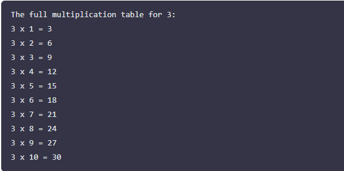

Below is an example output for a partial table display:

- If the user chooses a partial table:

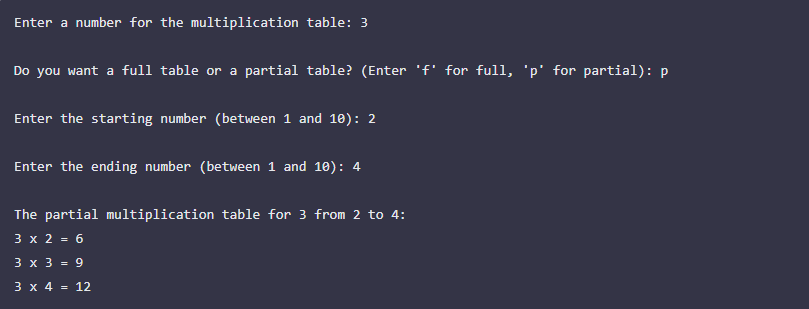

Handling Invalid Range If the user enters an invalid range:

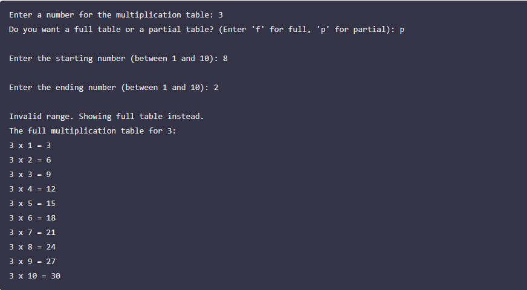

### Assessment Criteria

In this project, our assessment will encompass both our proficiency in creating a Bash script from what we've learned thus far and our capability to leverage Google for researching and implementing concepts that may have not been covered in our previous lessons.

Our project will be graded based on the following criteria:

1. Correctness and Functionality: 20%
2. Implementation and Use of Loops: 20%
3. Code Quality and Readability: 20%
4. Input Validation and Error Handling: 20%
5. User Interaction and Presentation: 20%

This project is designed to be a practical application of Bash scripting fundamentals, focusing on loops, conditional logic, and user interaction. By completing this task, you'll gain valuable experience in automating tasks and improving your scripting proficiency.

**Objective**: Write a Bash script that generates a multiplication table for a given number. The script should prompt the user to enter a number and then display the multiplication table for that number up to 10. Our task is to use both styles of for loops to achieve this: the list form and the C-style form.

### Part 1: 

**Using List Form For Loop Prompt the User**: First, our script should ask the user to input a number. Use the read command to capture this input into a variable.

**Generate Multiplication Table**: Use a list form for loop to iterate through the numbers 1 to 10. In each iteration, calculate the product of the user's number and the iterator variable, then print the result in a clear format.

### Part 2:

**Using C-style For Loop Repeat the Prompt**: 
We don't need to ask the user again if you're making this a single script. Just proceed with the C-style loop using the same variable.

**Generate Multiplication Table with C-style Loop**: Now, write a C-style for loop to achieve the same task as in Part 1. Compare how this approach differs from the list form loop in terms of syntax and clarity.

### Guidelines:

- Make sure the output is user-friendly and clearly formatted.
- Comment your code to explain which part is using the list form and which part is using the C-style.
- Bonus: Ask the user if they want to see the table in ascending or descending order, and implement this feature using if-else statements combined with your loop of choice.

#### Learning Objectives:

- Understand how to use variables to store user inputs and use them in calculations.
- Learn the syntax and use cases of both list form and C-style for loops.
- Practice using loops to automate repetitive tasks, such as generating a multiplication table.
- Enhance the script's interactivity and user-friendliness by incorporating user input and clear output formatting.

## Solution:

Create bash script file and give execution command. 

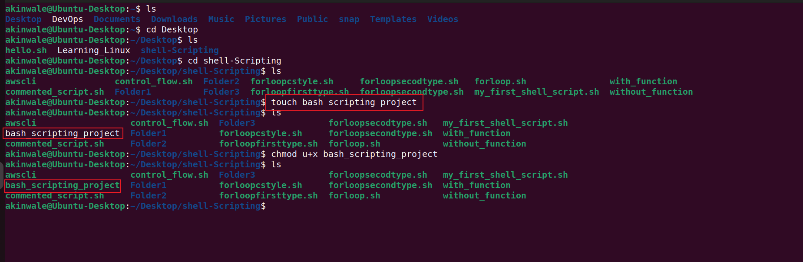

### Function to generate table using list-form loop:

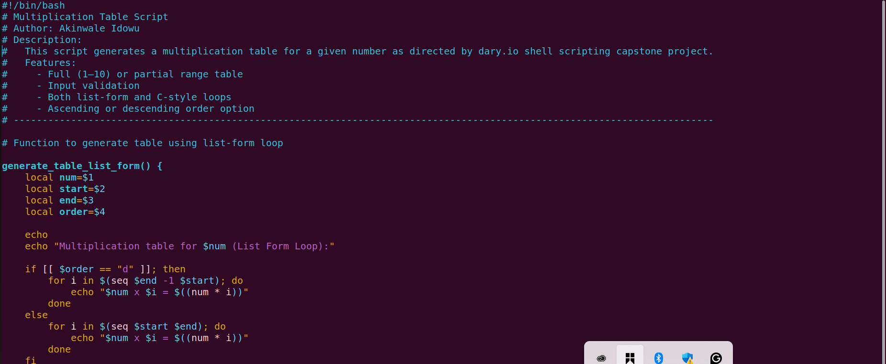

### Function to generate table using C-style loop

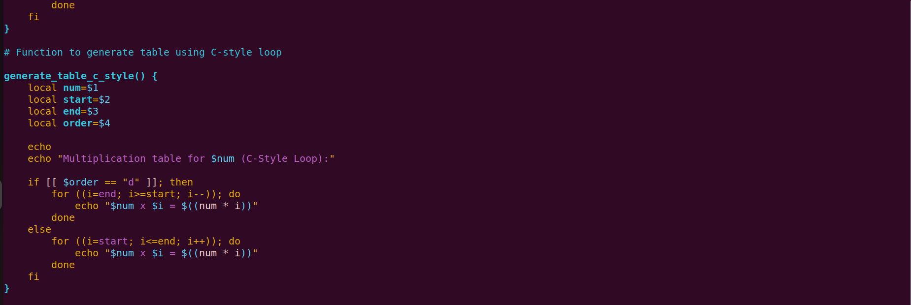

### Main Script

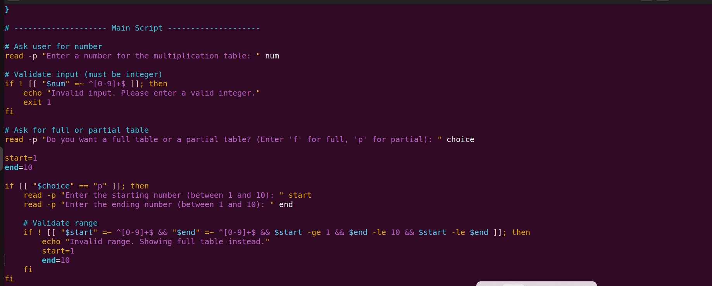

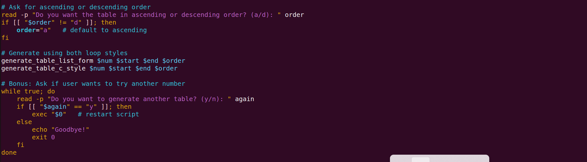

### Code OutPut

#### Partial Table Multiplication of 3

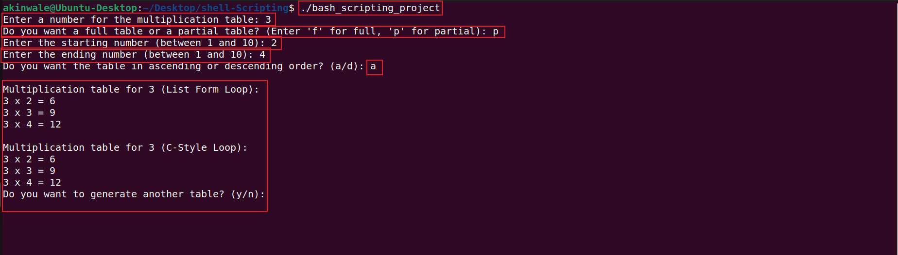

#### Handling Invalid Range if user enters an invalid range

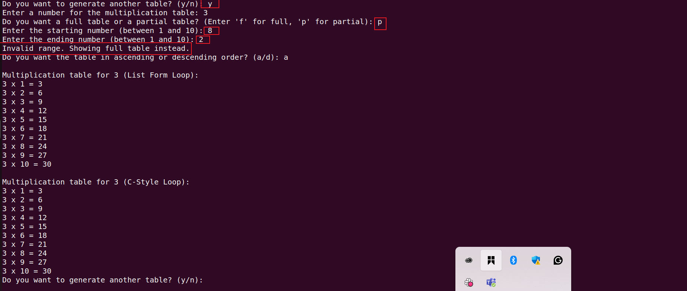

#### Code output in ascending and decending order

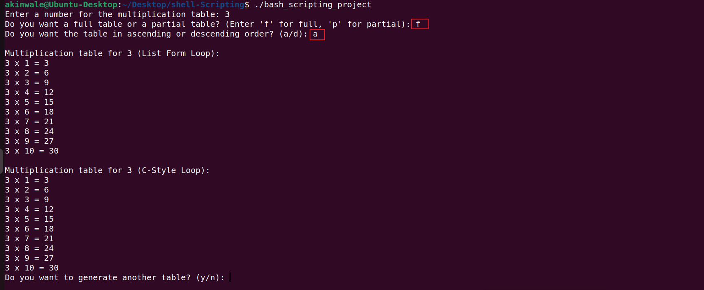

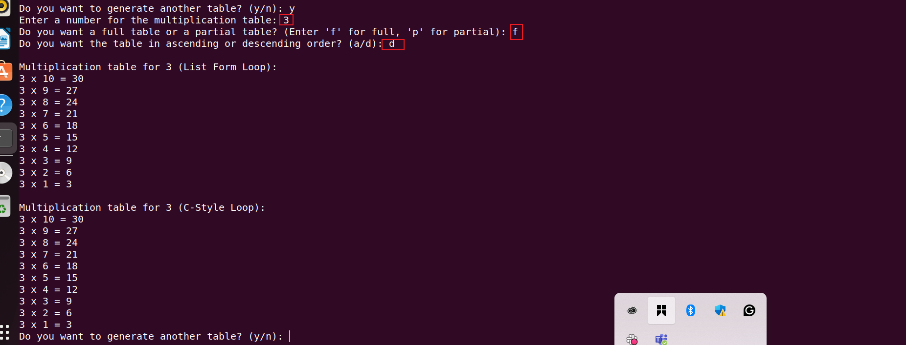

End!!!

