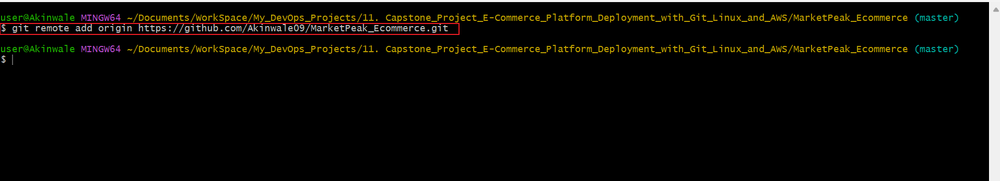
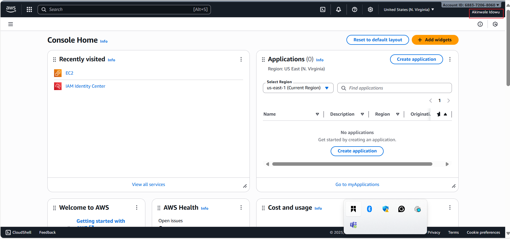

# Capstone Project: E-Commerce Platform Deployment with Git, Linux, and AWS

### Scenario

We have been assigned to develop an e-commerce website for a new online marketplace named **"MarketPeak."** This platform will feature product listings, a shopping cart, and user authentication. our objective is to utilize Git for version control, develop the platform in a Linux environment, and deploy it on an AWS EC2 instance. We can find a suitable website template (https://www.tooplate.com/) to kickstart our development.

# Tasks

## 1. Implement Version Control with Git
   
   1.1. Initialize Git Repository

  - Begin by creating a project directory named "MarketPeak_Ecommerce"
  
    

  - Inside this directory, initialize a Git repository to manage your version control.

      

   1.2. Obtain and Prepare the E-Commerce Website Template

   Instead of developing the website from scratch, we'll use a pre-existing e-commerce website template. This approach allows us to focus on the deployment and operational aspects, rather than on web development. The actual web development is done by web/software developers on the project.

   - Download a Website Template: Visit Tooplate or any other free template resource, and download a suitable e-commerce website template. Lets look for templates that are ready to use and require minimal adjustments from: https://www.tooplate.com
  
   - It is recommended you download the specific template https://www.tooplate.com/view/2114-pixie

   - Prepare the Website Template: Extract the downloaded template into our project directory, MarketPeak_Ecommerce.

     

   - Customize the Template (Optional): If desired and you have basic web development skills, you can make minor customizations to the template to tailor it to "MarketPeak" This might include updating logos, changing color schemes, or modifying text to better fit the marketplace's brand identity.

  1.3. Stage and Commit the Template to Git
 
- Add your website files to the Git repository.

   

- Set your Git global configuration with your username and email.
   

- Commit your changes with a clear, descriptive message.

   

1.4 Lets Push the code to our Github repository

After initializing our Git repository and adding our e-commerce website template, the next step is to push our code to a remote repository on GitHub. This step is crucial for version control and collaboration.

- Create a Remote Repository on GitHub: Log into your GitHub account and create a new repository named "MarketPeak_Ecommerce" Leave the repository empty without initializing it with a README, .gitignore, or license.

   
   

- Link Your Local Repository to GitHub: In our terminal, within our project directory, add the remote repository URL to our local repository configuration.

   `git remote add origin https://github.com/Akinwale09/MarketPeak_Ecommerce.git`

   

Note: Make sure you replace "your-git-username" with your actual git username

- Push our Code: Upload your local repository content to GitHub. 
  
  `git push -u origin master` 
  
  This command pushes your commits from your local main branch to the remote repository on GitHub, enabling you to store your project in the cloud and share it with others.

   

   

## 2. AWS Deployment

To deploy "MarketPeak_Ecommerce" platform, you'll start by setting up an Amazon EC2 instance:

2.1. Set Up an AWS EC2 Instance

- Log in to the AWS Management Console.

   

- Launch an EC2 instance using an Amazon Linux AMI.

   

- Connect to the instance using SSH.

   

2.2. Clone the repository to the Linux Server

Before deploying our e-commerce platform, you need to clone the GitHub repository to our AWS EC2 instance. This process involves authenticating with GitHub and choosing between two primary methods of cloning a repository: SSH and HTTPS. To see the ssh or http link to clone your repository

- Navigate to your repository in github console

   

- Select the code as highlighted in the image below.

   

SSH Method:

- On our EC2 instance, lets generate SSH keypair using ssh-keygen.

   `ssh-keygen`

   

- Display and Copy your public key

   `cat /home/ec2-user/.ssh/id_rsa.pub`

   

   Note: Your ssh public key will different

- Add the SSH public key to your GitHub account.

   
   

- Use the SSH clone URL to clone the repository:

   `git clone git@github.com:Akinwale09/MarketPeak_Ecommerce.git`

   

HTTPS Method:

For repositories that you plan to clone without setting up SSH keys, use the HTTPS URL. GitHub will prompt for your username and password:

   `git clone https://github.com/Akinwale09/MarketPeak_Ecommerce.git`

   

2.3. Install a Web Server on EC2

**Apache HTTP Server (httpd)** is a widely used web server that serves HTML files and content over the internet. Installing it on Linux EC2 server allows you to host MarketPeak E-commerce site:

- Install Apache web server on the EC2 instance. Note that httpd is the software name for Apache on systems using yum package manager

   `sudo yum update -y`

    

   `sudo yum install httpd -y`

    

   `sudo systemctl start httpd`

   

   `sudo systemctl enable httpd`

   

This first updates the linux server and then installs httpd (Apache), starts the web server, and ensures it automatically starts on server boot.

2.4. Configure httpd for Website

To serve the website from the EC2 instance, lets configure httpd to point to the directory on the Linux server where the website code files are stored. Usually in **/var/www/html**

- Prepare the Web Directory: Clear the default httpd web directory and copy MarketPeak Ecommerce website files to it.

   `sudo rm -rf /var/www/html/*`
   `sudo cp -r ~/MarketPeak_Ecommerce/* /var/www/html/`

   

   The directory /var/www/html/ is a standard directory structure on Linux systems that host web content, particularly for the **Apache HTTP Server.**

   When you install Apache on a Linux system, the installation process automatically creates this directory. It's designated as the default document root in Apache's configuration, meaning that Apache is set up to serve web files (such as HTML, CSS, and JavaScript files) located in this directory to visitors of your website.

- Reload httpd: Apply the changes by reloading the httpd service.

   `sudo systemctl reload httpd`

   

2.5. Access Website from Browser

- With httpd configured and website files in place, MarketPeak Ecommerce platform is now live on the internet:

- Let's open a web browser and access the public IP of our EC2 instance to view the deployed website. 
  
  **My web page using  ec2 IP: 184.72.161.140**

  

  **My web page using Public DNS: ec2-184-72-161-140.compute-1.amazonaws.com**

  

## 3. Continuous Integration and Deployment Workflow

To ensure a smooth workflow for developing, testing, and deploying our e-commerce platform, follow this structured approach. It covers making changes in a development environment, utilizing version control with Git, and deploying updates to your production server on AWS.

Step 1: Developing New Features and Fixes

- Create a Development Branch: Begin your development work by creating a separate branch. This isolates new features and bug fixes from the stable version of our website.

   

- Implement Changes: On the development branch, add your new features or bug fixes. This might include updating web pages, adding new products, or fixing known issues.

Step 2: Version Control with Git
 
- Stage Your Changes: After making your changes, add them to the staging area in Git. This prepares the changes for a commit.

   

- Commit Your Changes: Securely save your changes in the Git repository with a commit. Include a descriptive message about the updates.

   

- Push Changes to GitHub: Upload your development branch with the new changes to GitHub. This enables collaboration and version tracking.

   

Step 3: Pull Requests and Merging to the Main branch

- Create a Pull Request (PR): On GitHub, create a pull request to merge the development branch into the main branch. This process is crucial for code review and maintaining code quality.

- Review and Merge the PR: Review the changes for any potential issues. Once satisfied, merge the pull request into the main branch, incorporating the new features or fixes into the production codebase.

   

- Push the Merged Changes to GitHub: Ensure that your local main branch, now containing the updates, is pushed to the remote repository on GitHub.

   

Step 4: Deploying Updates to the Production Server

- Pull the Latest Changes on the Server: SSH into your AWS EC2 instance where the production website is hosted. Navigate to the website's directory and pull the latest changes from the main branch.  

   

- Restart the Web Server (if necessary): Depending on the nature of the updates, you may need to restart the web server to apply the changes.

   

Step 5: Testing the New Changes

- Access the Website: Open a web browser and navigate to the public IP address of your EC2 instance. Test the new features or fixes to ensure they work as expected in the live environment.
  
This workflow emphasizes best practices in software development and deployment, including branch management, code review through pull requests, and continuous integration/deployment strategies. By following these steps, you maintain a stable and up-to-date production environment for your e-commerce platform. 

End.