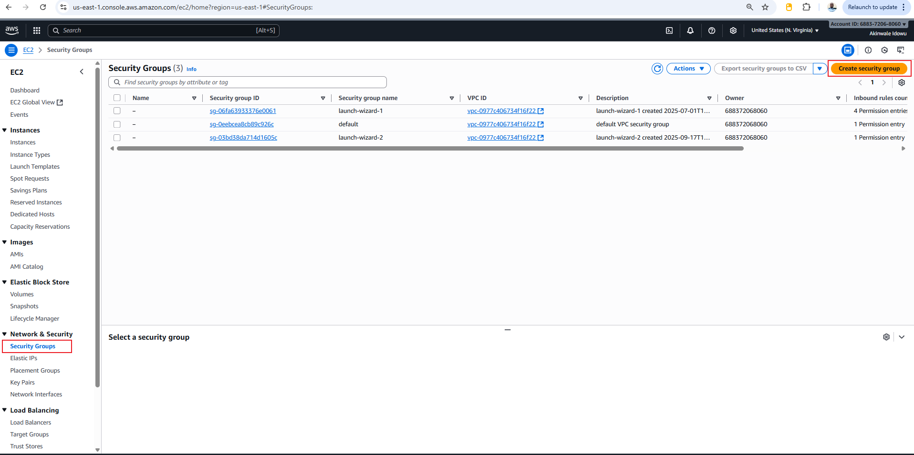
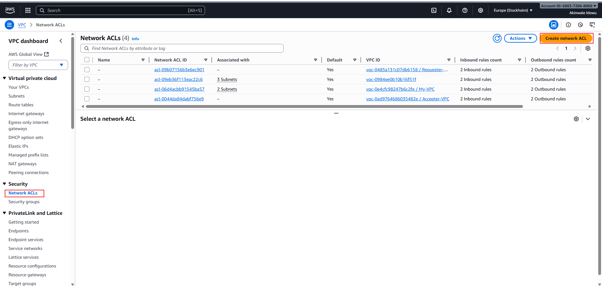

# Security Groups and NACLs Mini Project

During this project, we'll explore the core concepts of Amazon Web Services (AWS), specifically focusing on Security Groups and Network Access Control Lists (NACLs). Our objective is to understand these fundamental components of AWS infrastructure, including how Security Groups control inbound and outbound traffic to EC2 instances, and how NACLs act as subnet-level firewalls, regulating traffic entering and exiting subnets. Through practical demonstrations and interactive exercises, we'll navigate the AWS management console to deploy and manage these critical components effectively.

Before we proceed with setting up Security Groups and NACLs, it's essential to ensure a solid understanding of cloud networking basics.

### Project Goals:

- Understand the concepts of Security Groups and Network Access Control Lists (NACLs) in AWS.
- Explore how Security Groups and NACLs function as virtual firewalls to control inbound and outbound traffic.
- Gain hands-on experience with configuring Security Groups and NACLs to allow or deny specific types of traffic.

### Learning Outcome:

- Gain proficiency in configuring Security Groups and NACLs to control network traffic within AWS environments.
- Understand the differences between Security Groups and NACLs, including their scope, statefulness, and rule configurations.
- Learn how to troubleshoot network connectivity issues by analyzing Security Group and NACL configurations.
- Develop a deeper understanding of AWS networking concepts and best practices for securing cloud environments.

Let’s first understand some terms-

### Security Group (SG):

**Inbound Rules:** Rules that control the incoming traffic to an AWS resource, such as an EC2 instance or an RDS database.

**Outbound Rules:** Rules that control the outgoing traffic from an AWS resource.

**Stateful:** Security groups automatically allow return traffic initiated by the instances to which they are attached.

**Port:** A communication endpoint that processes incoming and outgoing network traffic. Security groups use ports to specify the types of traffic allowed.

**Protocol:** The set of rules that governs the communication between different endpoints in a network. Common protocols include TCP, UDP, and ICMP.

### Network Access Control List (NACL):

**Subnet-level Firewall:** NACLs act as a firewall at the subnet level, controlling traffic entering and exiting the subnet.

**Stateless:** Unlike security groups, NACLs are stateless, meaning they do not automatically allow return traffic. You must explicitly configure rules for both inbound and outbound traffic.

**Allow/Deny:** NACL rules can either allow or deny traffic based on the specified criteria.

**Ingress:** Refers to inbound traffic, i.e., traffic entering the subnet.

**Egress:** Refers to outbound traffic, i.e., traffic exiting the subnet.

**CIDR Block:** Specifies a range of IP addresses in CIDR notation (e.g., 10.0.0.0/24) that the NACL rule applies to.

#### Default Settings:

**Default Security Group:** Every VPC comes with a default security group that allows all outbound traffic and denies all inbound traffic by default.

**Default NACL:** Every subnet within a VPC is associated with a default NACL that allows all inbound and outbound traffic by default.

### What is Security Group?

Imagine you're hosting a big party at your house. You want to make sure only the people you invite can come in, and you also want to control what they can do once they're inside.

AWS security groups are like bouncers at the door of your party. They decide who gets to come in (inbound traffic) and who gets kicked out (outbound traffic). Each security group is like a set of rules that tells the bouncers what's allowed and what's not.

For example, you can create a security group for your web server that only allows traffic on port 80 (the standard port for web traffic) from the internet. This means only web traffic can get through, keeping your server safe from other kinds of attacks.

Similarly, you can have another security group for your database server that only allows traffic from your web server. This way, your database is protected, and only your web server can access it, like a VIP area at your party.

In simple terms, security groups act as barriers that control who can access your AWS resources and what they can do once they're in. They're like digital bouncers that keep your party (or your cloud) safe and secure.

### What is NACL?

NACL stands for Network Access Control List. Think of it like a security checkpoint for your entire neighborhood in the AWS cloud. Imagine your AWS resources are houses in a neighborhood, and you want to control who can come in and out. That's where NACLs come in handy.

NACLs are like neighborhood security guards. They sit at the entrance and check every person (or packet of data) that wants to enter or leave the neighborhood.

But here's the thing: NACLs work at the subnet level, not the individual resource level like security groups. So instead of controlling access for each house (or AWS resource), they control access for the entire neighborhood (or subnet).

You can set rules in your NACL to allow or deny traffic based on things like IP addresses, protocols, and ports. For example, you can allow web traffic (HTTP) but block traffic on other ports like FTP or SSH.

Unlike security groups, which are stateful (meaning they remember previous interactions), NACLs are stateless. This means you have to explicitly allow inbound and outbound traffic separately, unlike security groups where allowing inbound traffic automatically allows outbound traffic related to that session.

In simple terms, NACLs act as gatekeepers for your AWS subnets, controlling who can come in and out based on a set of rules you define. They're like the security guards that keep your neighborhood (or your AWS network) safe and secure.

### Difference between Security Groups and NACL

Security Groups in AWS act like virtual firewalls that control traffic at the instance level. They define rules for inbound and outbound traffic based on protocols, ports, and IP addresses. Essentially, they protect individual instances by filtering traffic, allowing only authorized communication.

On the other hand, Network Access Control Lists (NACLs) function at the subnet level, overseeing traffic entering and leaving subnets. They operate as a barrier for entire subnets, filtering traffic based on IP addresses and protocol numbers. Unlike security groups, NACLs are stateless, meaning they don't remember the state of the connection, and each rule applies to both inbound and outbound traffic independently.

*Note-* In security groups, there's no explicit "deny" option as seen in NACLs; any rule configured within a security group implies permission, meaning that if a rule is established, it's automatically allowed.

Let’s come to the practical part:

This practical will be in Two parts-

1. Security group

2. NACL

#### Security group

- Initially We’ll examine the configuration of inbound and outbound rules for security groups.
- Create a security group allowing HTTP for all traffic and attach it to the instance.

#### Explore various scenarios:

- Implement inbound traffic rules for HTTP and SSH protocols and allow outbound traffic for all.
- Configure inbound rules for HTTP with no outbound rules.
- Remove both inbound and outbound rules.
- Have no inbound rules but configure outbound rules for all traffic.

#### NACL

- Examine the default settings for both inbound and outbound rules in NACL configuration.
- Modify the inbound rules to permit traffic from any IPv4 CIDR on all ports.
- Adjust the outbound rules to allow traffic to all CIDRs.

## Part - 1

Just a quick reminder about the subnets we configured in our VPC in the [Previous project](./AWS VPC mini project.md) . In the public subnet, we've created an EC2 instance that is running, hosting our website. Now, let's take a moment to see if we can access the website using its public IP address.

So this EC2 instance hosts my E-commerce website.

Here's the security group configuration for the instance. In the inbound rules, only IPv4 SSH traffic on port 22 is permitted to access this instance.

For the outbound rule, you'll notice that all IPv4 traffic with any protocol on any port number is allowed, meaning this instance has unrestricted access to anywhere on the internet.

Now, let's test accessibility to the website using the public IP address assigned to this instance.

Here, let's retrieve the public IP address.

If you enter "http:// 52.87.151.223" into our Chrome browser, and hit enter, you'll notice that the page doesn't load; it keeps attempting to connect. And finally it’ll show this page. After some time, you'll likely see a page indicating that the site can't be reached.

This is because of the security group, because we haven't defined HTTP protocol in the security group so whenever the outside world is trying to go inside our instance and trying to get the data, security group is restricting it and that’s why we are unable to see the data.

To resolve this issue, we can create a new security group that allows HTTP (port 80) traffic.

1. Navigate to the "Security Groups" section on the left sidebar.
   
    a) Then click on "Create Security Group".

    

2. Please provide a name and description for the new security group.
 
   a) Ensure to select your VPC during the creation process.

   

   b) Click on add rule.

   

   c) Now, select "HTTP" as the type.

   

   d) Use 0.0.0.0/0 as the CIDR Block. (Here we are allowing every CIDR block by using this CIDR).

   

     Now you will see the rule have been created.

     

    e) Keep outbound rules as it is.

    

    f) Now, click on Create security group.

    

    Now, it is being created successfully.

    

Let’s attach this security group to our instance.  

3. Now navigate to the instance section of left side bar.

   a) Select the instance.

   b) Click on “Actions.”

   c) Choose “security.

   

   d) Click on “Change security group.”

   

4. Choose the security group you created.

   

   a) Click on “Add security group”

   
   
   b) You can see security group is being added, Click on “save.”

   Note - The security group named "Launch Wizard" you see is the default security group automatically attached when creating the instance. You can also edit this security group if needed.

   

5. Now it is being attached successfully,

   a) If you again copy the public IP address

   

   b) And write http:// 52.87.151.223 in Chrome, We’ll be able to see the data of our website.

   

   Currently, let's take a look at how our inbound and outbound rules are configured.

   This setup allows the HTTP and SSH protocols to access the instance. 

   

    The outbound rule permits all traffic to exit the instance.

    

    Through this rule, we're able to access the website.

    

6. let's see how removing the outbound rule affects the instance's connectivity. Means now, no one can go outside to this instance.
   
   a) Go to outbound tab.

   b) Click on “edit outbound rules”.

   

   c) Click on “Delete.”

   d) Click on “Save rules.”

   

   Now that we've removed the outbound rule, let's take a look at how it appears in the configuration.

   

   After making this change, let's test whether we can still access the website.

   

So, even though we've removed the outbound rule that allows all traffic from the instance to the outside world, we can still access the website. According to the logic we discussed, when a user accesses the instance, the inbound rule permits HTTP protocol traffic to enter. However, when the instance sends data to the user's browser to display the website, the outbound rule should prevent it. Yet, we're still able to view the website. Why might that be?

Security groups are stateful, which means they automatically allow return traffic initiated by the instances to which they are attached. So, even though we removed the outbound rule, the security group allows the return traffic necessary for displaying the website, hence we can still access it.

let's explore the scenario,

If we delete both the inbound and outbound rules, essentially, we're closing all access to and from the instance. This means no traffic can come into the instance, and the instance cannot send any traffic out. So, if we attempt to access the website from a browser or any other client, it will fail because there are no rules permitting traffic to reach the instance. Similarly, the instance won't be able to communicate with any external services or websites because all outbound traffic is also blocked.

7. You will be able to delete the inbound rule in the same way we have deleted the outbound rule.'

   a) Go to inbound tab.

   b) Click on edit inbound rule

   

   C) Click on delete

   d) Click on “Save rule.

   

   Currently, let's have a look at how our inbound and outbound rules are configured.

   
   

   Now, as both the inbound and outbound rules deleted, there's no way for traffic to enter or leave the instance. This means that any attempt to access the website from a browser or any other client will fail because there are no rules permitting traffic to reach the instance. In this state, the instance is essentially isolated from both incoming and outgoing traffic.

   So we can’t access the website now.

   

   In the next scenario,

   We'll add a rule specifically allowing HTTP traffic in the outbound rules. This change will enable the instance to initiate outgoing connections over HTTP.

8. Click on edit outbound rule in the outbound tab

   

   a) Click on “add rule”

   b) Choose type.

   c) Choose destination.

   d) Choose CIDR.

   e) Click on “save rules

   

   
   

   Now, let’s see if we can access the website

   

   So, we are not able to see it.

   But if you look here, we are able to go to the outside world from the instance. We are using here.

   

  **Note-** curl is a command-line tool that fetches data from a URL.

  As a result, the instance will be able to fetch data from external sources or communicate with other HTTP-based services on the internet. This adjustment ensures that while incoming connections to the instance may still be restricted, the instance itself can actively communicate over HTTP to external services.

  ### Part – 2

Let’s come to NACL,

1. First navigate to the search bar and search for VPC.
   
    a) Then click on VPC.

    

2. Navigate to the Network ACLs in the left sidebar.

    a) Click on “Create Network ACL.”

    

3. Now, provide a name for your Network ACL,

   a) Choose the VPC you created in the [Previous session](./AWS VPC mini project.md) for the practical on VPC creation,

   b) Then click on "Create network ACL".

   

4. If you selected the Network ACL you created,

   a) navigate to the "Inbound" tab.

   By default, you'll notice that it's denying all traffic from all ports.

   

5. Similarly, if you look at the outbound rules, you'll observe that it's denying all outbound traffic on all ports by default.

   b) Select the NACL.

   c) And navigate to the "Outbound" tab.

   

   To make changes:

   a) select the NACL

   b) Go to the "Inbound" tab.

   c) And click on "Edit inbound rules.

   

6. Now, click on “Add new rule.”

   

7. Now, choose the rule number.

   a) Specify the type.

   b) Select the source.

   c) And determine whether to allow or deny the traffic.

   d) Then click on ”Save changes.”

   

   Currently, this NACL is not associated with any of the subnets in the VPC.

   

8. Let’s associate it.

    a) Select your NACL.

    b) Click on "Actions."

    c) Choose "Edit subnet association."

    

    d) Then select your public subnet, as our instance resides in the public subnet.

    

    Once selected, you'll see it listed under "Selected subnets".

    e) Finally, click on "Save changes".

    

    We have successfully associated our public subnet to this NACL.

    

    As soon as you have attached this NACL to your public subnet, and then you try to access the website again by typing the URL http:107.20.35.178, you will notice that you are unable to see the website
    Note: There is change in Public IP because the Instance was stopped and start in another day. 

    

    Although we've permitted all traffic in the inbound rule of our NACL, we're still unable to access the website. This raises the question: why isn't the website visible despite these permissions?

The reason why we're unable to access the website despite permitting inbound traffic in the NACL is because NACLs are stateless. They don't automatically allow return traffic. As a result, we must explicitly configure rules for both inbound and outbound traffic.

Even though the inbound rule allows all traffic into the subnet, the outbound rules are still denying all traffic.

You can see here:

9. If we allow outbound traffic as well,

   a) Choose you NACL.

   b) Go to outbound tab.

   c) Click on “Edit outbound rules.”

   

   d) Click on “Add rule.”

   

   e) Duplicate the process you followed for creating the inbound rules to establish the outbound rules in a similar manner.

   

   We have successfully created the rules

   

   Upon revisiting the website, you should now be able to access it without any issues.

   

Now, let’s see one more interesting scenario

**In this scenario:**

**Security Group:** Allows inbound traffic for HTTP and SSH protocols and permits all outbound traffic.

**Network ACL:** Denies all inbound traffic. Let's observe the outcome of this configuration.

#### Security group

Configuring it: 

#### NACL

Let’s remove it so by default it be denied all traffic.

Additionally, the outbound rule will be removed, defaulting to deny all traffic by default.

Now, let’s try to access the website,

So we are unable to access the website. why? Even if we have allowed inbound traffic for HTTP in security group.

Imagine you're at the entrance of a building, and there's a security guard checking everyone who wants to come in. That security guard is like the NACL. They have a list of rules (like "no backpacks allowed" or "no food or drinks inside"), and they check each person against these rules as they enter.

Once you're inside the building, there's another layer of security at each room's door. These are like the Security Groups. Each room has its own rules, like "only employees allowed" or "no pets." These rules are specific to each room, just like Security Groups are specific to each EC2 instance.

So, the traffic first goes through the NACL (the security guard at the entrance), and if it passes those rules, it then goes through the Security Group (the security check at each room's door). If it doesn't meet any of the rules along the way, it's denied entry.

The reason we can't see the website is because the NACL has denied inbound traffic. This prevents traffic from reaching the security group, much like a security guard not allowing entry to another room if access to the building is denied. Similarly, if someone can't enter a building, they can't access any rooms inside without first gaining entry to the building."

### Let’s have a look on some scenarios and their outcomes:

- NACL allows all inbound and outbound traffic, Security Group denies all inbound and outbound traffic: Outcome: Website access will be blocked because the Security Group denies all traffic, overriding the NACL's allowance.

- NACL denies all inbound and outbound traffic, Security Group allows all inbound and outbound traffic: Outcome: Website access will be blocked because the NACL denies all traffic, regardless of the Security Group's allowances.

- NACL allows HTTP inbound traffic, outbound traffic is denied, Security Group allows inbound traffic and denies outbound traffic: Outcome: Website access will be allowed because the Security Group allows HTTP inbound traffic, regardless of the NACL's allowances. However, if the website requires outbound traffic to function properly, it won't work due to the Security Group's denial of outbound traffic.

- NACL allows all inbound and outbound traffic, Security Group allows HTTP inbound traffic and denies outbound traffic: Outcome: Website access will be allowed because the Security Group allows HTTP inbound traffic, regardless of the NACL's allowances. However, if the website requires outbound traffic to function properly, it won't work due to the Security Group's denial of outbound traffic.

- NACL allows all inbound and outbound traffic, Security Group allows all inbound and outbound traffic: Outcome: Website access will be allowed, as both NACL and Security Group allow all traffic.

- NACL denies all inbound and outbound traffic, Security Group allows HTTP inbound traffic and denies outbound traffic: Outcome: Website access will be blocked because the NACL denies all traffic, regardless of the Security Group's allowances.

### Project Reflection:

- Successfully configured Security Groups and NACLs to control inbound and outbound traffic in AWS.
- Identified the differences between Security Groups and NACLs and their respective roles in network security.
- Explored various scenarios to understand how Security Groups and NACLs interact and impact network traffic.
- Learned valuable troubleshooting techniques for diagnosing and resolving network connectivity issues in AWS.
- Overall, gained practical experience and confidence in managing network security within AWS environments.

END. 

