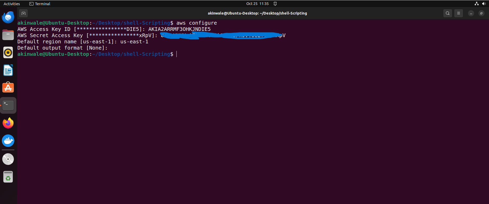
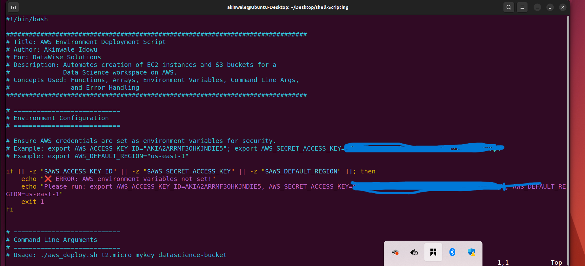
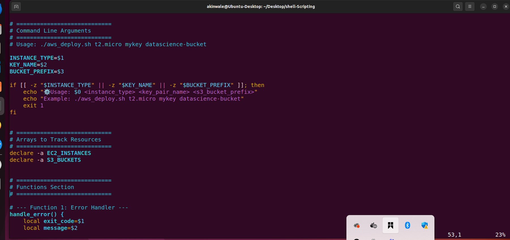
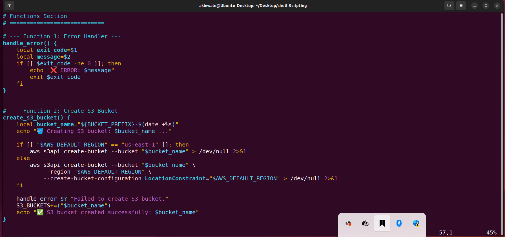
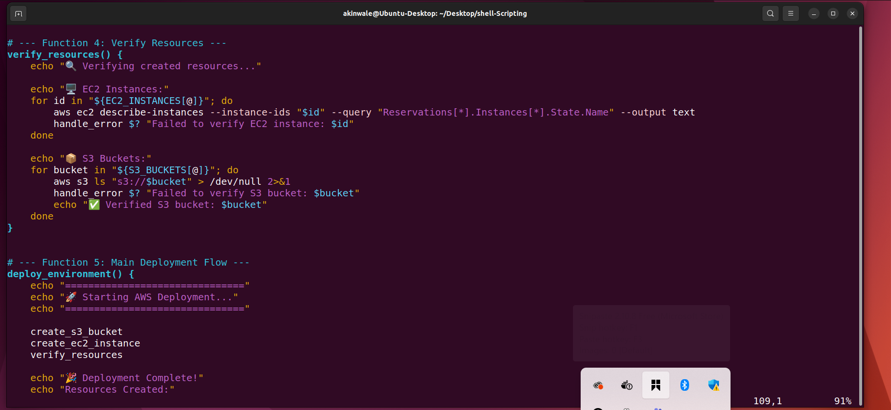
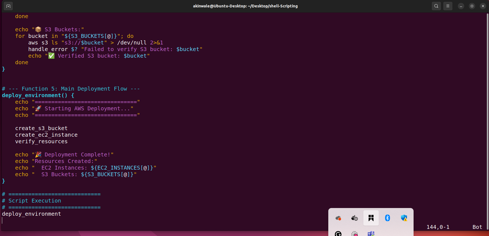
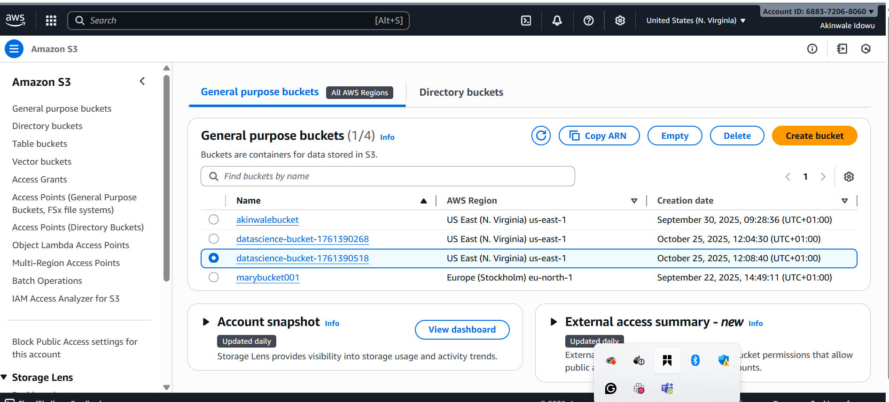

# Mini Project - 5 Essential Skills to Elevate Your Shell Scripting Journey into Cloud Computing

As we embark on the next phase of our journey into tech, getting your feet strong in shell scripting is one of the most important, and foundational skills you must not miss. The skills and concepts you've mastered so far have laid the groundwork for what comes next. However, the journey ahead is not just a continuation—it's a leap towards achieving great success in the realms of Cloud, DevOps, System Engineering, and related fields. The areas we are about to explore are not merely topics; they are the keys to unlocking profound capabilities in automation, problem-solving, and innovation in the digital world.

### Objective

Our objective for the next series of projects is to advance your shell scripting skills while also integrating and utilizing cloud services. By focusing on the following 5 critical concepts, we aim to elevate your capabilities to a level where you can confidently navigate and harness the power of both shell scripting and cloud computing. This combination is not just about learning commands and services; it's about understanding how to leverage these tools in unison to build, deploy, and manage scalable, efficient, and robust systems in the cloud.

- Functions
- Arrays
- Environment Variables
- Command Line Arguments
- Error Handling
  
### Delivering the shell script based on a real world requirement.

#### Background:

**DataWise Solutions** is a forward-thinking Data Science Consulting Company that specializes in deploying analytical and machine learning environments to support data-driven decision-making for its clients. Recognizing the need for agility and efficiency in setting up such environments, DataWise has decided to streamline its deployment process on AWS, focusing on simplicity and automation.

### Scenario:

One of DataWise Solutions' clients, a burgeoning e-commerce startup, is looking to harness the power of data science to analyze customer behavior and enhance their shopping experience. The startup wishes to deploy their data science workspace on AWS, utilizing EC2 instances for computational tasks and S3 buckets for storing their vast datasets of customer interactions.

### Specific Requirements:

To meet the client's needs and ensure a practical learning experience, DataWise Solutions plans to develop a script that automates the setup of EC2 instances and S3 buckets. This script will incorporate the 5 critical shell scripting concepts previously identified:

1. **Functions:** Implement custom functions to modularize tasks like creating EC2 instances, configuring S3 buckets, and verifying deployment statuses.

2. **Arrays:** Use arrays to manage a list of resources created, ensuring easy tracking and manipulation.

3. **Environment Variables:** Leverage environment variables to store sensitive information like AWS credentials, region settings, and configuration parameters, enhancing script portability and security.

4. **Command Line Arguments:** Accept command line arguments to customize the script’s behavior, such as specifying the EC2 instance type or S3 bucket name, allowing for dynamic and flexible deployments.

5. **Error Handling:** Implement robust error handling mechanisms to catch and respond to AWS service exceptions, ensuring the script can recover gracefully from failures.

The purpose of this project is to ensure that you understand the requirement. Your understanding doesn't have to be perfect at this stage. In the next project, we will begin proper implementation.

Your submission for this mini project should be to explain what you think the requirement is.

### Solution

#### Project Understanding: Automating AWS Environment Deployment with Shell Scripting

**Objective Overview:**

The goal of this project is to strengthen shell scripting skills by applying them to real-world cloud automation specifically, automating the setup of AWS resources. The script will automate the deployment of EC2 instances (for compute power) and S3 buckets (for data storage) to create a data science workspace for a client.

To achieve this, we’ll build a shell script that combines five key scripting concepts:

 1. Functions
 2. Arrays
 3. Environment variables 
 4. Command line arguments, and 
 5. Error handling 
    
    To make the automation process modular, dynamic, secure, and reliable.

#### Scenario Summary

**Organization:** DataWise Solutions
**Client:** A growing e-commerce startup
**Client Need:** The client wants to deploy a cloud-based data science environment that can process and analyze customer data efficiently.
***Platform:** AWS Cloud
**Resources to Automate:**

   - EC2 instances – to handle computation and analysis workloads

   - S3 buckets – to store large datasets such as customer behavior logs

The automation script would make it quick, repeatable, and error-resistant to set up these resources whenever needed.

### My Understanding of the Requirements

1.  Functions

The script should be organized into modular functions for better readability and maintainability.

Example functions might include:

**create_ec2_instance()** – to launch a new EC2 instance with specified parameters.

**create_s3_bucket()** – to create a new S3 bucket and apply desired configurations.

**verify_resources()** – to confirm that EC2 and S3 resources have been successfully deployed.

Functions will make the script cleaner and allow reuse of code blocks when scaling or modifying my setup.

2. Arrays

Arrays will be used to store and track multiple AWS resources efficiently.

For instance:

- An array to store the list of EC2 instance IDs created.

- Another array for all S3 bucket names generated during execution.

This helps in tasks like verification, reporting, or resource cleanup after deployment.

3. Environment Variables

Sensitive and reusable data (like AWS credentials, default region, instance type, or key pair) will be stored as environment variables.

- This improves security by avoiding hardcoding credentials in the script.

- It also enhances portability, as users can modify configurations without editing the script itself.

4. Command Line Arguments

The script should accept parameters directly from the command line, making it flexible and dynamic.

Here:

- The first argument could define the EC2 instance type.

- The second could specify the S3 bucket name.

This allows different users or teams to customize deployments easily without modifying the script each time.

5. Error Handling

Robust error handling will be essential to ensure reliability. The script should:

- Detect failed AWS commands.

- Display clear error messages.

- Log issues for troubleshooting.

- Exit gracefully when critical failures occur (e.g., invalid credentials, resource creation errors).

By the end of this project, the script would be able to:

1. Automatically create EC2 instances and S3 buckets on AWS.

2. Handle multiple resources efficiently using arrays.

3. Keep configurations and credentials secure using environment variables.

4. Be flexible enough to adapt to different deployment needs through command line arguments.

5. Be resilient and professional through proper error handling.

We’re building a reusable, configurable, and error-tolerant shell script that can quickly set up a data science environment on AWS for clients a task that reflects how automation works in real-world DevOps and Cloud Engineering environments.

Successfully created EC2 intance and S3 Bucket running the script

Checking my AWS console management, EC2 instance successfully lunch

Checking my AWS console management, S3 Bucket successfully created

In this project we are able develop a shell script that automates the setup of AWS resources specifically EC2 instances for computation and S3 buckets for data storage on behalf of DataWise Solutions client. The script incorporate five key shell scripting concepts: functions for modularization, arrays for managing multiple resources, environment variables for secure configuration, command line arguments for flexibility, and error handling for reliability. This project simulate a real-world DevOps scenario where automation improves efficiency, scalability, and accuracy in deploying cloud-based data science environments.

END. 