# Mini Project - Creating AWS resources with functions & introducing Arrays

## We'll begin this project by creating two functions:

1. One for provisioning EC2 instances and
2. Another for setting up S3 buckets.

These functions will streamline the process of resource creation and enable us to automate tasks effectively.

### Function to provision EC2 instances

To programmatically create EC2 instances, we must use the official documentation https://docs.aws.amazon.com/cli/latest/reference/ec2/ to understand how to use the aws cli to create instances. https://docs.aws.amazon.com/cli/latest/reference/ec2/

From the Available Commands, you will be able to interact with AWS programmatically.

Let's search for **run-instances** on the page with **Control F** on our key board, click on it and it will take you to the detailed documentation on the sub-command to create EC2 instances.

Below is an example of how you would create EC2 instances using the command line.

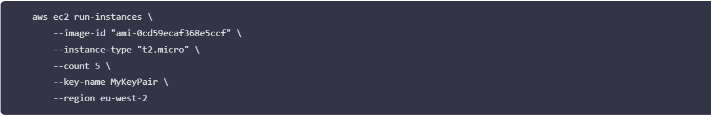
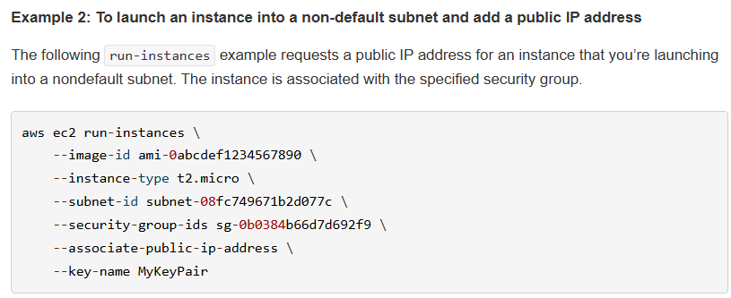

**Note:** Make sure you have a key pair created in your aws console. The you can replace the **MyKeyPair** with you key pair name.

On the same page, if you search for one of the arguments, you will be able to read more about how to pass different arguments to the cli.

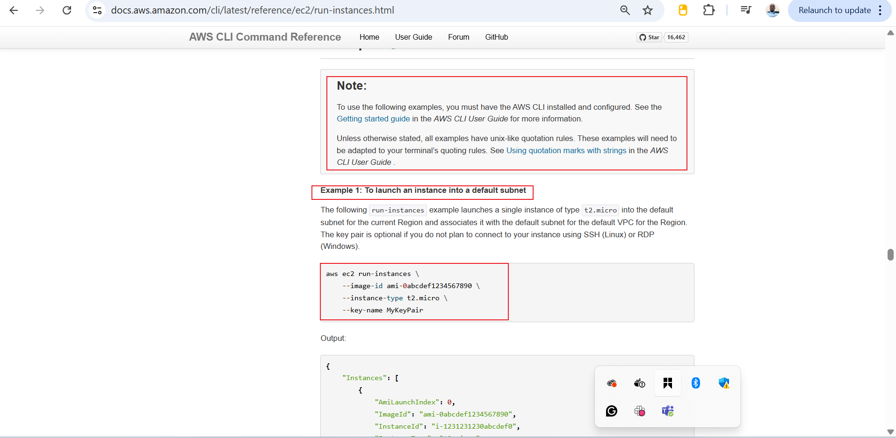
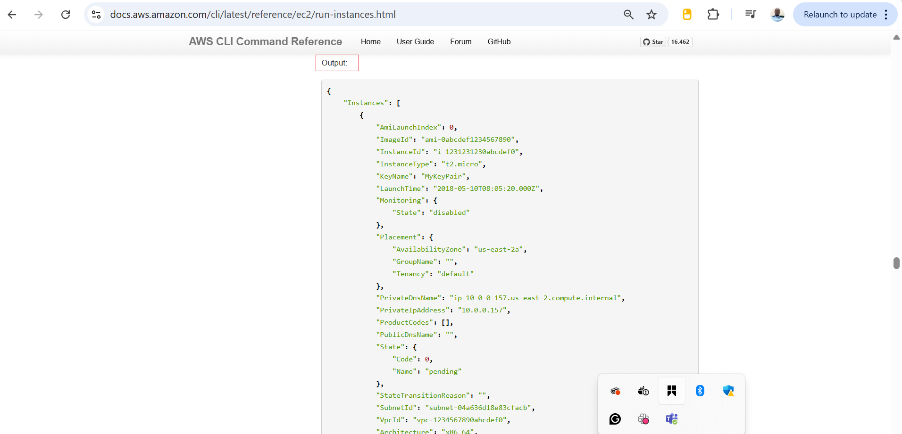

For the command to work: A keypair must already exist. You must create a keypair from the console. To create a new key pair.

1. Navigate to the AWS EC2 console

2. Follow the image below to create a key pair

   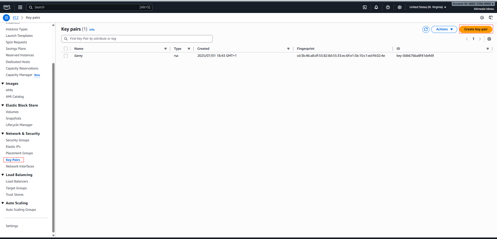
   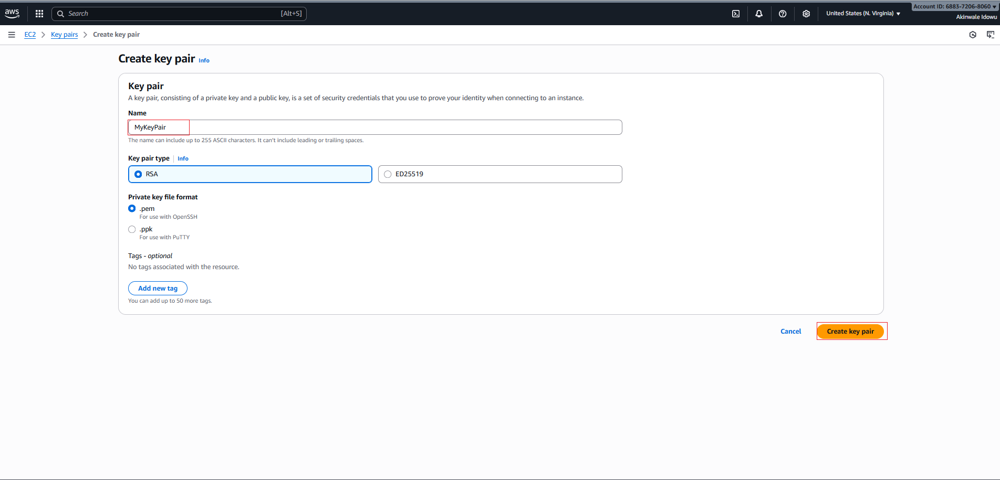

Now, lets update the shell script and create a function that will be responsible for creating EC2 instances.

### Function to Create EC2 Instance:

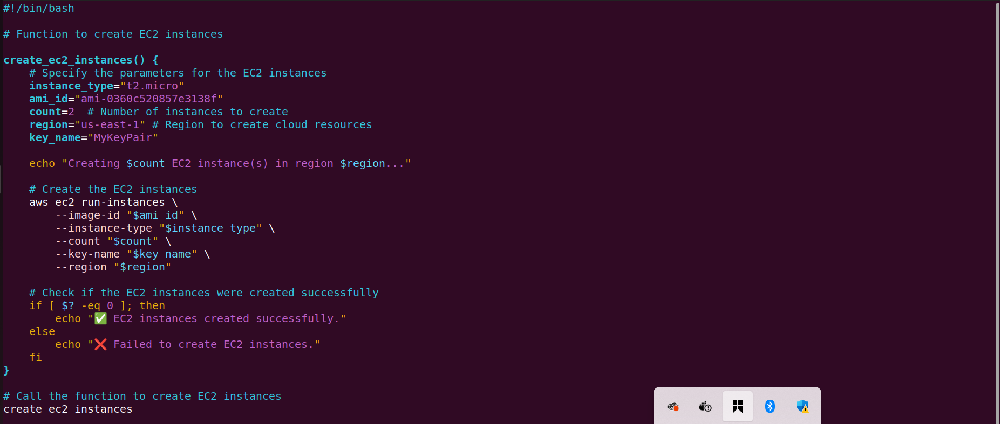

Instance created successfully checking from CLI
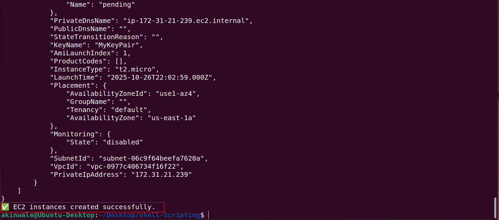

Checking Instance created from the AWS console management:

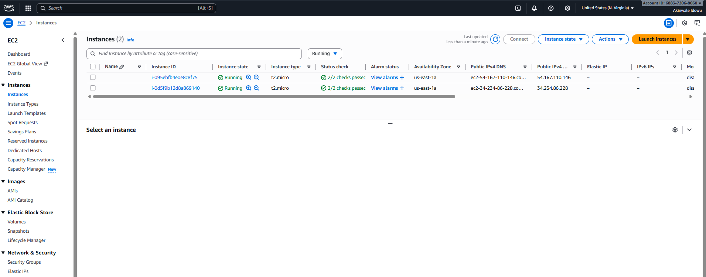

#### Lets highlight some new areas

- $?: This is a special variable that holds the exit status of the last executed command. In this case, it checks if the aws ec2 run-instances command was successful. exit status that equals 0 is interpreted as succesful. Therefore if exit code is "0", then echo the message to confirm that the previous command was successful.
- We have once again used environment variables to hold the value of ami_id, count and region and replaced with their respective values with amiid,id,count and $region

### Define function to create S3 buckets & learn about Arrays

Before diving into creating S3 buckets, it's beneficial to brush up on AWS S3 bucket concepts. If you need a quick refresher, consider watching this informative video. https://www.youtube.com/watch?v=e6w9LwZJFIA&pp=ygURd2hhdCBpcyBzMyBidWNrZXQ%3D

The AWS CLI reference for S3 can be found here. We will be using it in the script. https://docs.aws.amazon.com/cli/latest/reference/s3api/

In this section, our objective is to create five distinct S3 buckets, each designated for storing data related to Marketing, Sales, HR, Operations, and Media.

To achieve this, we'll utilize a fundamental data structure in shell scripting known as an "array." this is because, we need one single variable holding all the data, and then have the capability to loop through them.

### Arrays in Shell Scripting

An array is a versatile data structure that allows us to store multiple values under a single variable name. Particularly in shell scripting, arrays offer an efficient means of managing collections of related data, making them invaluable for our task ahead.

**Below is what the function woould look like.**

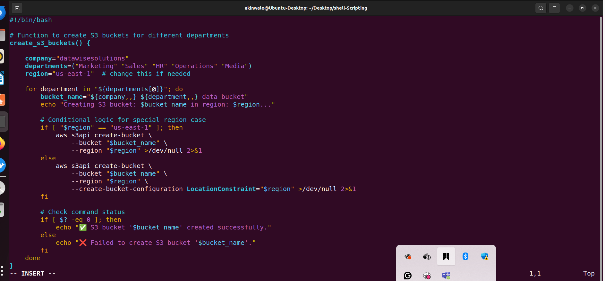
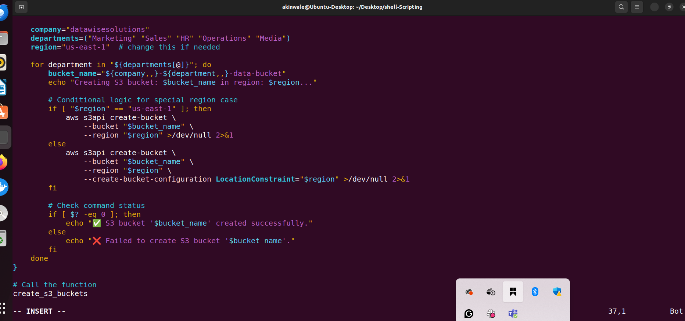
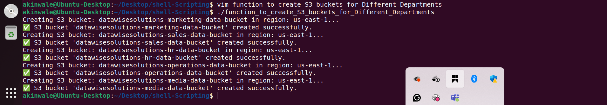
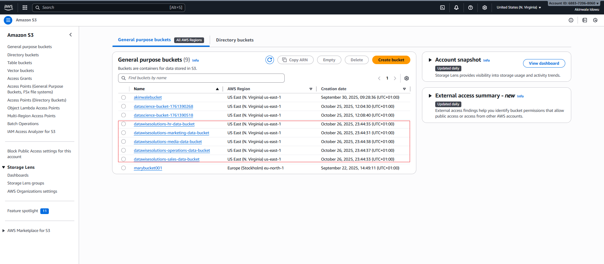

### Lets break down each part of the code.

**Line-by-line & block explanation**

1. `#!/bin/bash`

- Shebang line. Tells the OS to run this file with Bash.

- Without it, the script may run with /bin/sh (which may behave differently).

2. `create_s3_buckets() { ... }`

- Defines a Bash function named create_s3_buckets.

- Using a function groups logic so you can call it (or extend it) easily.

3. `company="datawisesolutions"`

- A variable holding the company prefix for bucket names.

- Easy to change in one place instead of editing bucket naming across the script.

4. `departments=("Marketing" "Sales" "HR" "Operations" "Media")`

- A Bash array with department names.

- Arrays are iterated using "${departments[@]}" to preserve spaces or special characters (if any).

5. `region="us-east-1"`

- Sets the AWS region for bucket creation.

- Important: S3 bucket creation CLI parameters differ for us-east-1 vs other regions (explained below).

6. `for department in "${departments[@]}"; do`

- Standard loop over the array. Each iteration sets department to the next item

7. `bucket_name="${company,,}-${department,,}-data-bucket"`

- Constructs a canonical bucket name by:

- ${var,,}: converts $var to lowercase (Bash parameter expansion).

- S3 bucket names must be lowercase and follow other naming rules (see below).

- Using - separators and a fixed suffix -data-bucket for consistency and readability.

- Example result: datawisesolutions-marketing-data-bucket.

8. echo "Creating S3 bucket: ..."

- Prints a progress message so you can see what the script is attempting.
  
`Region special-case:`

9. 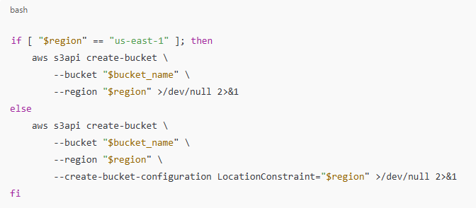

- Why the conditional?**

- AWS S3 create-bucket has a quirk: when creating a bucket in us-east-1 (the N. Virginia region), you must not pass --create-bucket-configuration LocationConstraint=us-east-1 — older/newer CLI versions and the S3 API treat it differently and it causes an error.

- For all other regions, you must include --create-bucket-configuration LocationConstraint=<region> so the bucket is created in the chosen region.

- >/dev/null 2>&1:

   - Redirects both stdout and stderr to /dev/null to keep the terminal clean.

   - During debugging you may want to remove this to see AWS CLI error messages.
  

10. `if [ $? -eq 0 ]; then ... fi`

- $? is the exit status of the previous command.

   - 0 means success.

   - non-zero means failure.

- This block prints success (✅) or failure (❌) messages accordingly.

- Note: Because we silenced CLI output with >/dev/null 2>&1, you’ll only see these messages. If creation fails, you’ll want to see the AWS CLI error — remove the redirection while debugging.

11. `create_s3_buckets (call)`

- Executes the function defined above.

### The complete script till this stage will now look like this.

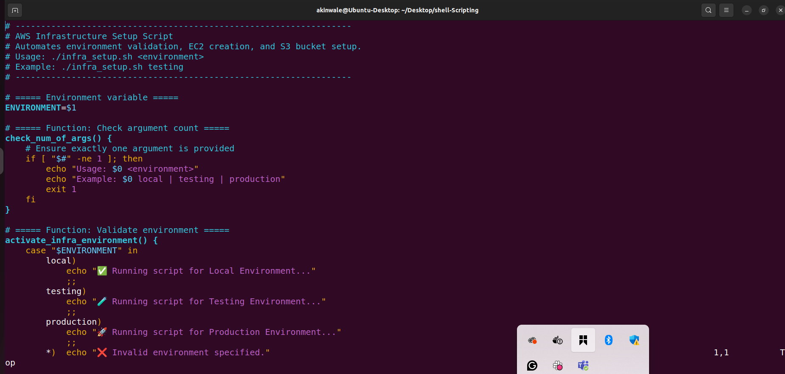

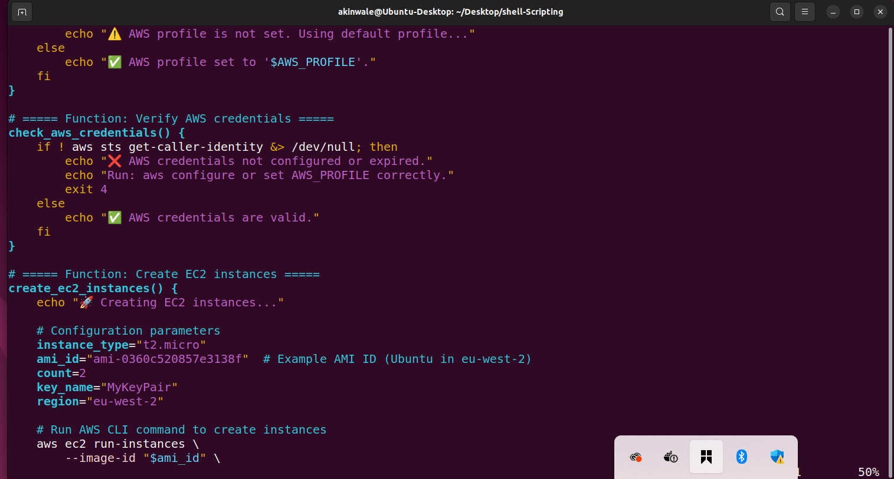
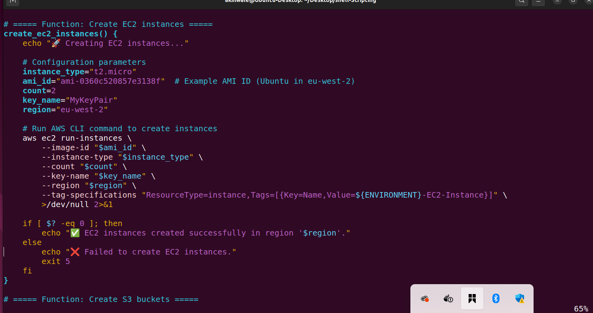
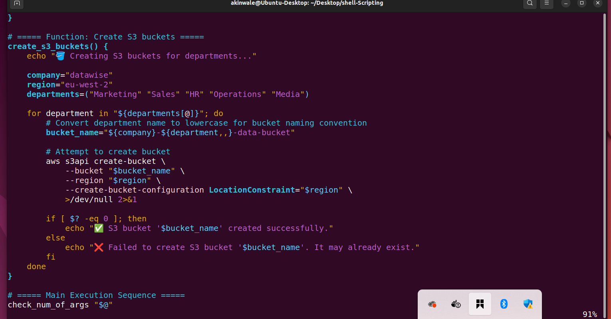
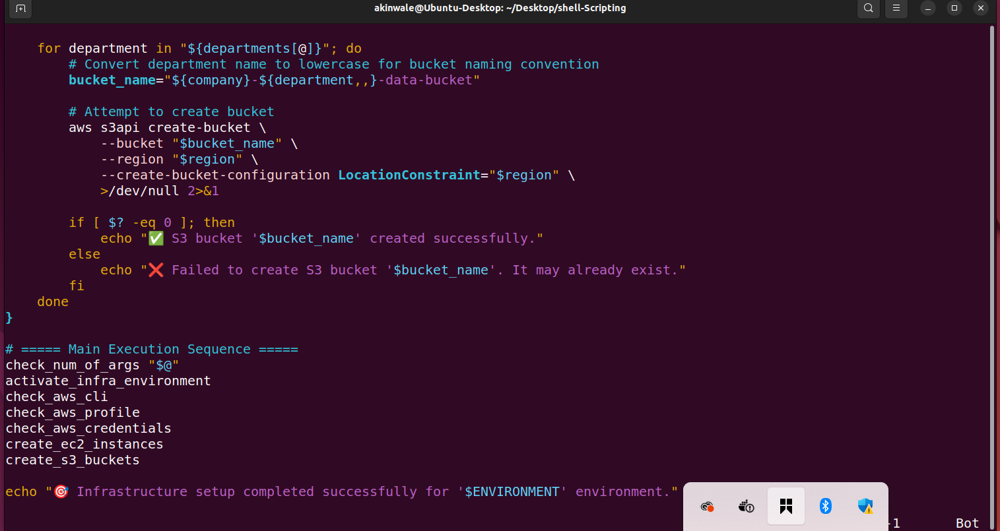

**My learning in summary:**

In this mini project, I learned how to automate AWS resource creation using Bash scripting with functions and arrays. I created two main functions one to provision EC2 instances using the aws ec2 run-instances command and another to create multiple S3 buckets using an array to store department names. I also incorporated essential scripting techniques such as defining environment variables, validating arguments, checking for AWS CLI installation, and verifying AWS profiles. The use of the special variable $? helped to determine command success or failure, improving script reliability. Additionally, I learned how arrays simplify handling multiple related values, enabling the creation of several S3 buckets in a loop efficiently. Overall, this project strengthened my understanding of AWS CLI automation, function modularization, and array operations in shell scripting — key skills for infrastructure automation in cloud environments.

End. 

