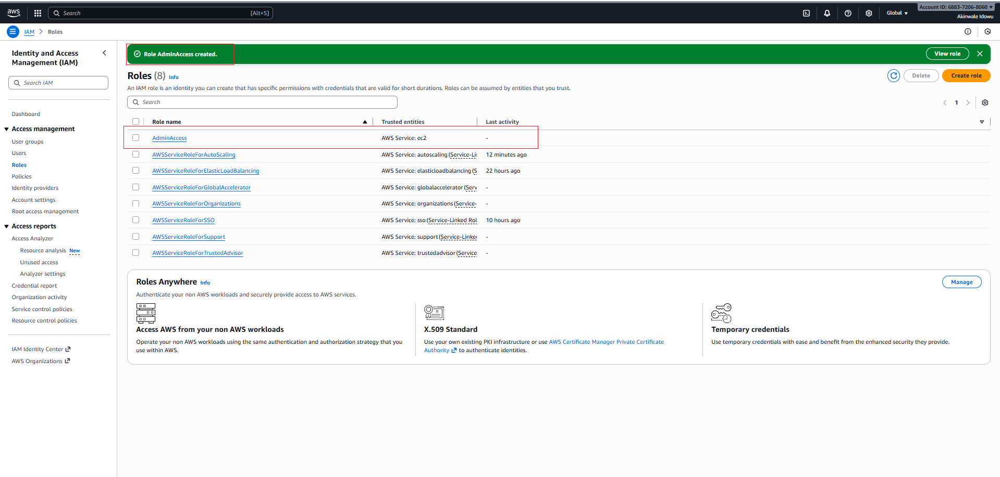
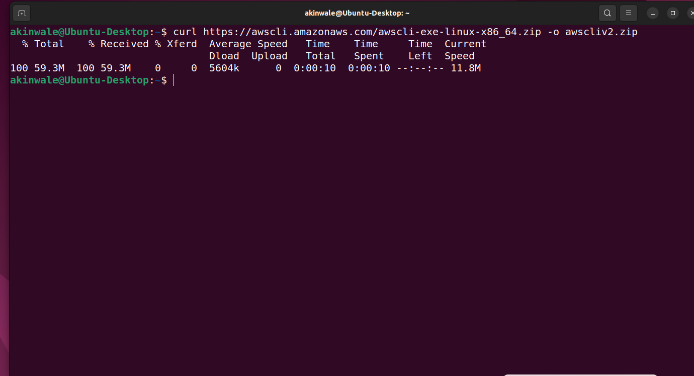
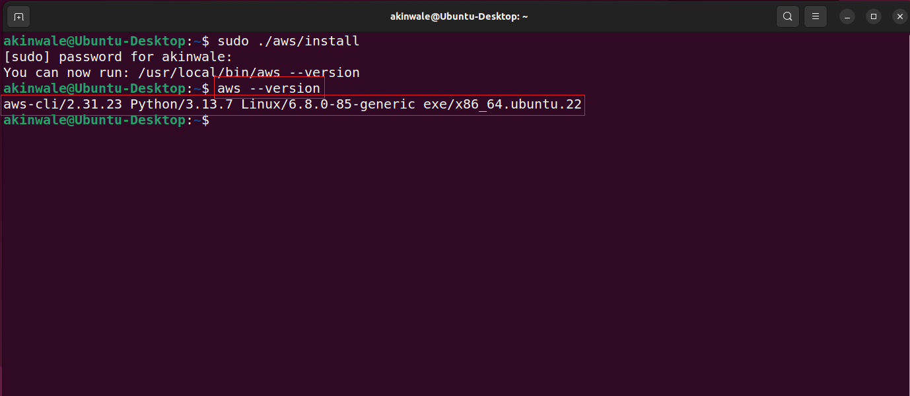
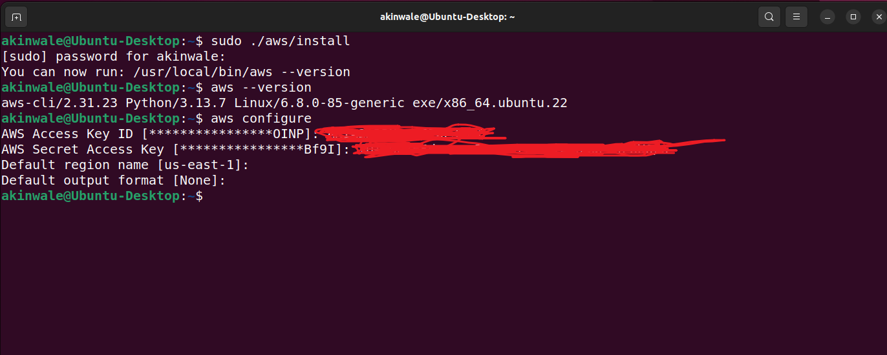

# Mini Project - Setting Up Secure Authentication to AWS API

Following the requirement detailed in the previous project, the initial step in crafting our script is to ensure we have the necessary AWS account setup for authentication and resource management in the cloud. This setup is crucial for enabling the script to create EC2 instances and S3 buckets efficiently.

#### Here's how to proceed:

1. **Create an IAM Role:** Begin by establishing an IAM role that encapsulates the permissions required for the operations our script will perform.

    
    

2. **Create an IAM Policy:** Design an IAM policy granting full access to both EC2 and S3 services. This policy ensures our script has the necessary permissions to manage these resources.

    
    
    
    

3. **Create an IAM User:** Instantiate an IAM user named automation_user. This user will serve as the primary entity our script uses to interact with AWS services.

    
    

4. **Assign the User to the IAM Role:** Link the automation_user to the previously created IAM role to inherit its permissions. This step is vital for enabling the necessary access levels for our automation tasks.

    
    

5. **Attach the IAM Policy to the User:** Ensure that the automation_user is explicitly granted the permissions defined in our IAM policy by attaching the policy directly to the user. This attachment solidifies the user's access to EC2 and S3 resources.

   
   

6. **Create Programmatic Access Credentials:** Generate programmatic access credentials — specifically, an access key ID and a secret access key for automation_user. These credentials are indispensable for authenticating our script with the AWS API through the Linux terminal, allowing it to create and manage cloud resources programmatically.

    
    
    

### Installing and Configuring the AWS CLI

After setting up your AWS account and creating the necessary IAM user and permissions, the next step involves installing the AWS Command Line Interface (CLI). The AWS CLI is a powerful tool that allows you to interact with AWS services directly from your terminal, enabling automation and simplification of AWS resource management.

### Downloading and Installing AWS CLI

### On Linux:

1. Download the AWS CLI version 2 installation file for Linux

    `curl "https://awscli.amazonaws.com/awscli-exe-linux-x86_64.zip" -o "awscliv2.zip"`

    

2. Uzip the installer
  
   `unzip awscliv2.zip`

   

3. Run the installer

    `sudo ./aws/install`

    
    

### On Windows:

1. Download the Installer:
   
   Visit the official AWS CLI version 2
    https://docs.aws.amazon.com/cli/latest/userguide/getting-started-install.html#getting-started-install-instructions download page and download the MSI installer for Windows.
   https://awscli.amazonaws.com/AWSCLIV2.msi

2. Run the Installer:
   
    Execute the downloaded MSI installer and follow the on-screen instructions to complete the installation.

    
    

3. Verify Installation: 
   
    Open the Command Prompt and type aws --version to ensure the CLI is installed correctly. You should see the version of the AWS CLI displayed.

    

### On macOS:

Note: I do not use Mac to show the steps

1. In your browser, download the macOS pkg file

2. Run your downloaded file and follow the on-screen instructions.

    The installer automatically creates a symlink at /usr/local/bin/aws that links to the main program in the installation folder you chose.

3. Verify Installation: 
    In your Terminal, type aws --version to check if the installation was successful. You should see the AWS CLI version information.

### Configuring the AWS CLI

Once the AWS CLI is installed, the next step is to configure it to use the access key ID and secret access key generated for your automation_user. This will authenticate your CLI (Command Line Interface) requests to the AWS API.

### Understanding APIs

Before proceeding further, it's essential to understand what an **API (Application Programming Interface)** is and its relevance here. An API is a set of protocols and tools that allows different software applications to communicate with each other. In the context of AWS, the AWS API enables your scripts or the AWS CLI to interact with AWS services programmatically. This means you can create, modify, and delete AWS resources by making API calls, which are just structured requests that the AWS platform can understand and act upon.

#### Configurating AWS CLI for access to AWS:

Open your terminal or Command Prompt and enter

`aws configure`

This command initiates the setup process for your AWS CLI installation.

**Enter Your Credentials:**

When prompted, enter the AWS Access Key ID and AWS Secret Access Key for the automation_user. Ensure these are kept secure and are not shared.

On Linux:

On Window

Next, specify the Default region name and Default output format. The region should match the one you plan to deploy resources in, and a common output format is json.

### Testing the Configuration:

To verify that your AWS CLI is configured correctly and can communicate with AWS services, try running a basic command to list all the AWS regions:

`aws ec2 describe-regions --output table`

This command queries the EC2 service for a list of all regions and formats the output as a table, which makes it easy to read. You will receive a list of regions.

Region Table Linux

Region Table Window

Now we are ready to begin developing our shell script.

In this project, I learned how to securely authenticate and interact with AWS services programmatically using the AWS Command Line Interface (CLI) and API. The process begins with creating an IAM role, policy, and user specifically, an automation_user who is granted permissions to manage EC2 and S3 resources through a custom IAM policy. Programmatic access credentials (Access Key ID and Secret Access Key) are then generated for this user, enabling secure API-based communication between the terminal and AWS services.

After setting up IAM configurations, I installed and configured the AWS CLI, which acts as a bridge between the terminal and AWS APIs. Using the command aws configure, I authenticated the CLI by providing the generated credentials, default region, and output format. Once configured, I verified successful communication with AWS by running aws ec2 describe-regions --output table.

Through this exercise, I deepened my understanding of APIs — specifically, how the AWS API allows scripts and automation tools to make structured requests to create, modify, or delete resources on AWS. This foundational setup ensures secure, efficient, and automated management of AWS cloud infrastructure through command-line operations.

END.